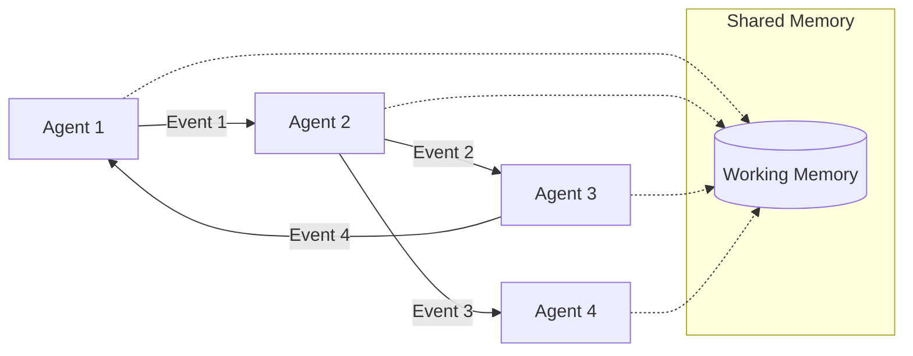

# Asynchronous Capabilities in Mojentic

Mojentic provides robust asynchronous capabilities through its `AsyncDispatcher` and asynchronous agent classes. These features enable you to build complex, high-performance agent systems that can process multiple events concurrently.

## Small Units of Computation

Agents are the smallest unit of computation in Mojentic. They are responsible for processing events and emitting new
events. Agents can be combined to form complex systems.

Agents have a single public method that receive an event and return a list of events. This method is called
`receive_event`.

Each Agent has its own state, and you can use its constructor to configure it, and provide it simple mechanisms like
shared memory or access to knowledge or data, that it can use in its computations.

Within that one method, is where the Agent does it's work, alone.

This will require you to break down the work you want to do into these small units of computation. Incoming events are
like commands, think tell-don't-ask in the extreme.

## Event-Driven Architecture

> The event-driven nature of is also very much in flux. Early thread-based agents lead to more complex synchronization
> than I wanted, so I'm using different agent formations to explore eventing in a more practical way.

> The key purpose of events will be to support traceability and debugging of agentic flows.

Mojentic provides both synchronous and asynchronous event processing capabilities.
The [AsyncDispatcher](#asyncdispatcher) enables concurrent event processing, allowing multiple agents to work
simultaneously for improved performance and responsiveness. This is particularly valuable for complex workflows
involving multiple LLM calls or other high-latency operations.

Events are the only way agents communicate with each other. Events are simple data classes that are passed around the
system. Events are immutable.

Here's a high-level overview of how events flow through the system:



The diagram above shows how agents communicate through events (solid lines) and can access shared working memory (dotted
lines) when needed.

## Introduction to Asynchronous Processing

Asynchronous processing is particularly valuable in agent-based systems where:

- Multiple agents need to process events concurrently
- Some operations (like LLM calls) have significant latency
- You need to maintain responsiveness while handling complex workflows
- You want to maximize throughput in multi-agent systems

Mojentic's asynchronous capabilities are built on Python's `asyncio` library and provide a clean, event-driven architecture for building sophisticated agent systems.

## Key Components

### AsyncDispatcher

The `AsyncDispatcher` is the core component for asynchronous event processing in Mojentic. It manages an event queue and dispatches events to appropriate agents based on routing rules.

```python
from mojentic.async_dispatcher import AsyncDispatcher
from mojentic.router import Router

# Create a router and register agents
router = Router()
# ... register agents with router ...

# Create and start the dispatcher
dispatcher = await AsyncDispatcher(router).start()

# Dispatch events
dispatcher.dispatch(my_event)

# Wait for all events to be processed
await dispatcher.wait_for_empty_queue()

# Stop the dispatcher when done
await dispatcher.stop()
```

Key features of the `AsyncDispatcher`:

- **Event Queue Management**: Efficiently manages a queue of events to be processed
- **Batch Processing**: Processes events in configurable batch sizes for optimal performance
- **Asynchronous Dispatch**: Uses `asyncio` for non-blocking event processing
- **Graceful Shutdown**: Provides methods to stop processing and wait for the queue to empty
- **Tracing Support**: Integrates with Mojentic's tracing system for observability

### Asynchronous Agents

Mojentic provides base classes for creating asynchronous agents:

#### BaseAsyncAgent

The `BaseAsyncAgent` class is the foundation for all asynchronous agents in Mojentic. It defines the `receive_event_async` method that asynchronous agents must implement.

```python
from mojentic.agents.base_async_agent import BaseAsyncAgent
from mojentic.event import Event
from typing import List

class MyAsyncAgent(BaseAsyncAgent):
    async def receive_event_async(self, event: Event) -> List[Event]:
        # Process the event asynchronously
        # ...
        return [new_event]  # Return any new events to be dispatched
```

#### BaseAsyncLLMAgent

The `BaseAsyncLLMAgent` extends `BaseAsyncAgent` with LLM capabilities, allowing you to create agents that use LLMs asynchronously.

```python
from mojentic.agents.async_llm_agent import BaseAsyncLLMAgent
from mojentic.event import Event
from typing import List

class MyAsyncLLMAgent(BaseAsyncLLMAgent):
    def __init__(self, llm):
        super().__init__(
            llm=llm,
            behaviour="You are a helpful assistant.",
            response_model=MyResponseModel
        )

    async def receive_event_async(self, event: Event) -> List[Event]:
        # Use the LLM asynchronously
        response = await self.generate_response("Your prompt here")
        return [new_event]  # Return any new events to be dispatched
```

#### AsyncAggregatorAgent

The `AsyncAggregatorAgent` is a specialized asynchronous agent that collects multiple events before processing them together. This is useful for tasks that require combining information from multiple sources.

```python
from mojentic.agents.async_aggregator_agent import AsyncAggregatorAgent
from mojentic.event import Event
from typing import List

class MyAggregatorAgent(AsyncAggregatorAgent):
    def __init__(self):
        super().__init__(event_types_needed=[EventType1, EventType2, EventType3])

    async def process_events(self, events):
        # Process the collected events
        # ...
        return [new_event]  # Return any new events to be dispatched
```

## Example: Asynchronous Text Analysis System

The following example demonstrates how to build an asynchronous text analysis system using Mojentic's asynchronous capabilities. This system analyzes and summarizes text concurrently, then combines the results.

```python
import asyncio
from typing import List
from pydantic import BaseModel, Field

from mojentic.agents.async_aggregator_agent import AsyncAggregatorAgent
from mojentic.agents.async_llm_agent import BaseAsyncLLMAgent
from mojentic.agents.base_async_agent import BaseAsyncAgent
from mojentic.async_dispatcher import AsyncDispatcher
from mojentic.event import Event, TerminateEvent
from mojentic.llm import LLMBroker
from mojentic.router import Router

# Define events
class TextEvent(Event):
    text: str

class AnalysisEvent(Event):
    analysis: str

class SummaryEvent(Event):
    summary: str

class CombinedResultEvent(Event):
    text: str
    analysis: str
    summary: str
    combined: str

# Define response models
class AnalysisResponse(BaseModel):
    analysis: str

class SummaryResponse(BaseModel):
    summary: str

class CombinedResponse(BaseModel):
    combined: str

# Define agents
class TextAnalyzerAgent(BaseAsyncLLMAgent):
    def __init__(self, llm: LLMBroker):
        super().__init__(
            llm=llm,
            behaviour="You are a text analysis assistant.",
            response_model=AnalysisResponse
        )

    async def receive_event_async(self, event: Event) -> List[Event]:
        if isinstance(event, TextEvent):
            prompt = f"Analyze this text: {event.text}"
            response = await self.generate_response(prompt)
            return [AnalysisEvent(
                source=type(self), 
                correlation_id=event.correlation_id, 
                analysis=response.analysis
            )]
        return []

class TextSummarizerAgent(BaseAsyncLLMAgent):
    def __init__(self, llm: LLMBroker):
        super().__init__(
            llm=llm,
            behaviour="You are a text summarization assistant.",
            response_model=SummaryResponse
        )

    async def receive_event_async(self, event: Event) -> List[Event]:
        if isinstance(event, TextEvent):
            prompt = f"Summarize this text: {event.text}"
            response = await self.generate_response(prompt)
            return [SummaryEvent(
                source=type(self), 
                correlation_id=event.correlation_id, 
                summary=response.summary
            )]
        return []

class ResultCombinerAgent(AsyncAggregatorAgent):
    def __init__(self, llm: LLMBroker):
        super().__init__(event_types_needed=[TextEvent, AnalysisEvent, SummaryEvent])
        self.llm = llm
        self.response_model = CombinedResponse

    async def process_events(self, events):
        text_event = next((e for e in events if isinstance(e, TextEvent)), None)
        analysis_event = next((e for e in events if isinstance(e, AnalysisEvent)), None)
        summary_event = next((e for e in events if isinstance(e, SummaryEvent)), None)

        if text_event and analysis_event and summary_event:
            # Combine the results
            combined = f"Original text: {text_event.text}\n\nAnalysis: {analysis_event.analysis}\n\nSummary: {summary_event.summary}"

            return [CombinedResultEvent(
                source=type(self),
                correlation_id=text_event.correlation_id,
                text=text_event.text,
                analysis=analysis_event.analysis,
                summary=summary_event.summary,
                combined=combined
            )]
        return []

class ResultOutputAgent(BaseAsyncAgent):
    async def receive_event_async(self, event: Event) -> List[Event]:
        if isinstance(event, CombinedResultEvent):
            print("\n=== FINAL RESULT ===")
            print(event.combined)
            print("===================\n")

            return [TerminateEvent(source=type(self), correlation_id=event.correlation_id)]
        return []

# Main function
async def main():
    # Initialize the LLM broker
    llm = LLMBroker(model="your-model-name")

    # Create a router and register agents
    router = Router()

    # Create agents
    analyzer = TextAnalyzerAgent(llm)
    summarizer = TextSummarizerAgent(llm)
    combiner = ResultCombinerAgent(llm)
    output_agent = ResultOutputAgent()

    # Register agents with the router
    router.add_route(TextEvent, analyzer)
    router.add_route(TextEvent, summarizer)
    router.add_route(TextEvent, combiner)
    router.add_route(AnalysisEvent, combiner)
    router.add_route(SummaryEvent, combiner)
    router.add_route(CombinedResultEvent, output_agent)

    # Create and start the dispatcher
    dispatcher = await AsyncDispatcher(router).start()

    # Create a text event
    text = "Your text to analyze and summarize"
    event = TextEvent(source="ExampleSource", text=text)

    # Dispatch the event
    dispatcher.dispatch(event)

    # Wait for all events to be processed
    await dispatcher.wait_for_empty_queue()

    # Stop the dispatcher
    await dispatcher.stop()

if __name__ == "__main__":
    asyncio.run(main())
```

## Advanced Usage: Customizing AsyncDispatcher

You can customize the `AsyncDispatcher` to fit your specific needs:

```python
from mojentic.async_dispatcher import AsyncDispatcher
from mojentic.router import Router
from mojentic.tracer import Tracer

# Create a router
router = Router()

# Create a tracer for observability
tracer = Tracer()

# Create a customized AsyncDispatcher
dispatcher = AsyncDispatcher(
    router=router,
    shared_working_memory=my_shared_memory,  # Optional shared memory
    batch_size=10,  # Process 10 events per batch
    tracer=tracer  # Use custom tracer
)

# Start the dispatcher
await dispatcher.start()
```

## API Reference

For detailed API documentation, see [Layer 2 - Agents API](api_2.md#event-driven-agents).

## Best Practices

When working with Mojentic's asynchronous capabilities, keep these best practices in mind:

1. **Use Correlation IDs**: Always ensure events have correlation IDs to track related events through the system.

2. **Handle Exceptions**: Implement proper exception handling in your asynchronous agents to prevent crashes.

3. **Monitor Queue Size**: For production systems, monitor the event queue size to detect potential bottlenecks.

4. **Batch Size Tuning**: Adjust the batch size based on your workload characteristics for optimal performance.

5. **Graceful Shutdown**: Always use the `stop()` method to gracefully shut down the dispatcher.

6. **Tracing**: Use the tracing system to monitor and debug your asynchronous agent system.

7. **Timeout Management**: Implement timeouts for `wait_for_empty_queue()` to prevent indefinite waiting.

8. **Event Design**: Design your events to carry all necessary information without requiring additional lookups.

## Conclusion

Mojentic's asynchronous capabilities provide a powerful foundation for building complex, high-performance agent systems. By leveraging the `AsyncDispatcher` and asynchronous agent classes, you can create systems that efficiently process events concurrently, making the most of available resources and providing responsive, scalable solutions.