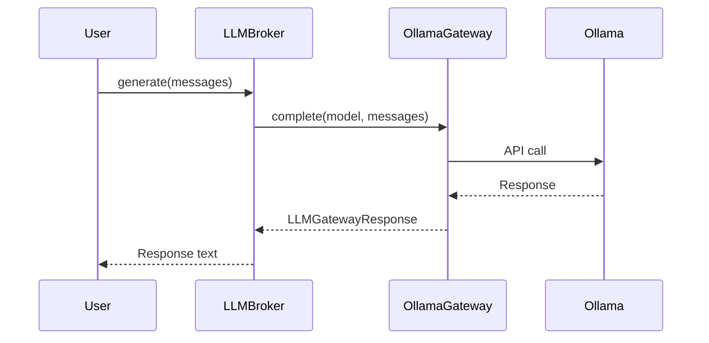
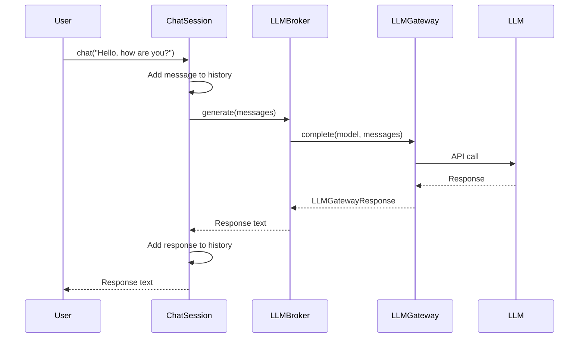
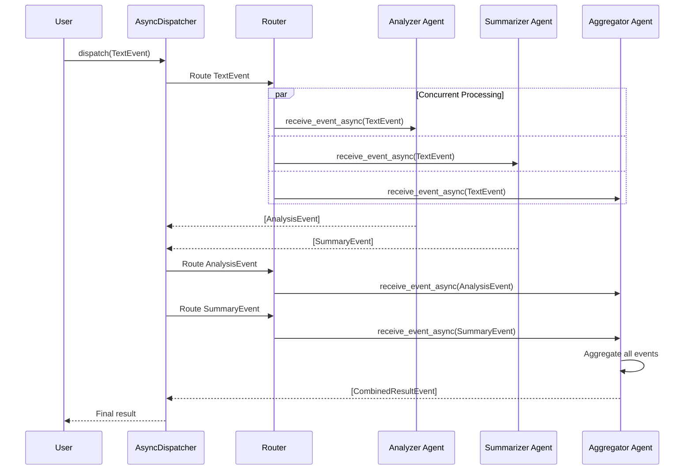

from mojentic.llm.gateways import OllamaGateway

# Mojentic

Mojentic is a multi-layered framework that aims to provide a simple and flexible way to perform low
level operations with LLMs, apply simple agents to intermediate tasks, or assemble teams of agents to
solve complex problems.

Design goals are
- simple to use to do simple things
- provide an abstraction that allows you to flexibly work with multiple LLM providers
- instead of the popular directed-graph or delegation style agent formations, mojentic aims to provide an asynchronous pubsub architecture for agentic work

> The agentic aspects of this framework are in the highest state of flux.
> The [first layer](api_1.md) has stabilized, as have the simpler parts of the [second layer](api_2.md), and we're working on the stability of the asynchronous pubsub architecture.
> We expect Python 3.14 will be the real enabler for the async aspects of the second layer.

## Examples

The following diagrams illustrate key usage patterns in Mojentic. For detailed architectural information about agents and events, see [Asynchronous Capabilities](async_capabilities.md).

### Simple One-Shot Completion

Simple things should be simple...

```python
from mojentic.llm import LLMBroker
from mojentic.llm.gateways import OllamaGateway
from mojentic.llm.gateways.models import LLMMessage

llm = LLMBroker(model="qwen3:32b", gateway=OllamaGateway())
response = llm.generate(messages=[LLMMessage(content="Hello, how are you?")])
print(response)
```

This diagram shows the simple sequence from the above code.



### Chat Session

This diagram shows how ChatSession wraps LLMBroker to provide a conversational interface with automatic message history management:



### Asynchronous Multi-Agent System

This diagram shows how multiple agents process events concurrently using the AsyncDispatcher:


