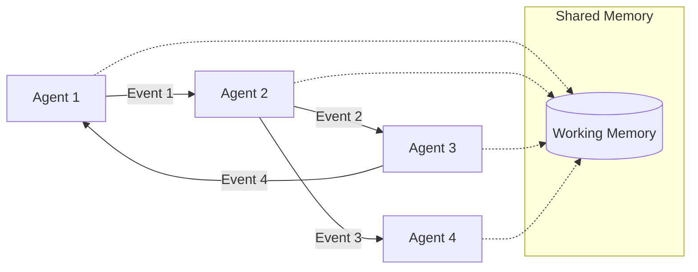

# Mojentic

Mojentic is an agentic framework that aims to provide a simple and flexible way to assemble teams of agents to solve
complex problems. Design goals are to be asynchronous with a pubsub messaging architecture.

## Small Units of Computation

> The agentic aspects of this framework are in the highest state of flux. This is a very early draft. The [first layer](api_1.md)
> has stabilized, but the [second layer](api_2.md) is being used right now to explore a variety of ideas.

Agents are the smallest unit of computation in Mojentic. They are responsible for processing events and emitting new
events. Agents can be combined to form complex systems.

Agents have a single public method that receive an event and return a list of events. This method is called
`receive_event`.

Each Agent has its own state, and you can use its constructor to configure it, and provide it simple mechanisms like
shared memory or access to knowledge or data, that it can use in its computations.

Within that one method, is where the Agent does it's work, alone.

This will require you to break down the work you want to do into these small units of computation. Incoming events are
like commands, think tell-don't-ask in the extreme.

## Event-Driven

> The event-driven nature of is also very much in flux. Early thread-based agents lead to more complex synchronization
> than I wanted, so I'm using different agent formations to explore eventing in a more practical way.

> The key purpose of events will be to support traceability and debugging of agentic flows.

Mojentic provides both synchronous and asynchronous event processing capabilities. The [AsyncDispatcher](async_capabilities.md) enables concurrent event processing, allowing multiple agents to work simultaneously for improved performance and responsiveness. This is particularly valuable for complex workflows involving multiple LLM calls or other high-latency operations.

Events are the only way agents communicate with each other. Events are simple data classes that are passed around the
system. Events are immutable.

Here's a high-level overview of how events flow through the system:

The diagram above shows how agents communicate through events (solid lines) and can access shared working memory (dotted lines) when needed.
