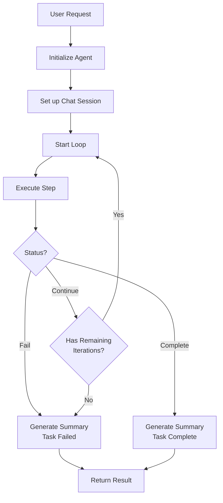

# Iterative Problem Solver

The `IterativeProblemSolver` is a simple agentic loop that repeatedly attempts to solve a user's request using available tools until it either succeeds, fails, or reaches a maximum number of iterations.

#### How It Works



At each step, the agent attempts to make progress on the user's request using the available tools. It continues until one of three conditions is met:
1. It successfully completes the task (responds with "DONE")
2. It fails to complete the task (responds with "FAIL")
3. It reaches the maximum number of allowed iterations

#### Basic Usage

```python { linenums=1 }
from mojentic.agents import IterativeProblemSolver
from mojentic.llm import LLMBroker
from mojentic.llm.tools.date_resolver import ResolveDateTool

# Initialize an LLM broker
llm = LLMBroker(model="your-preferred-model")

# Define a user request
user_request = "What's the date next Tuesday?"

# Create the problem solver with necessary tools
solver = IterativeProblemSolver(
    llm=llm,
    available_tools=[ResolveDateTool()],
    max_iterations=3  # Maximum number of iterations
)

# Run the solver and get the final result
result = solver.solve(user_request)
print(result)
```
