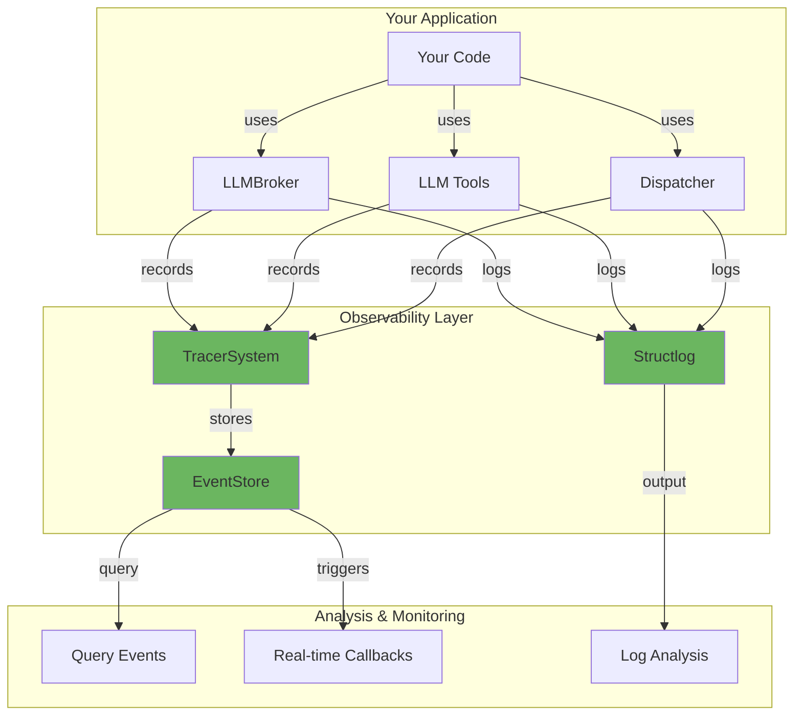
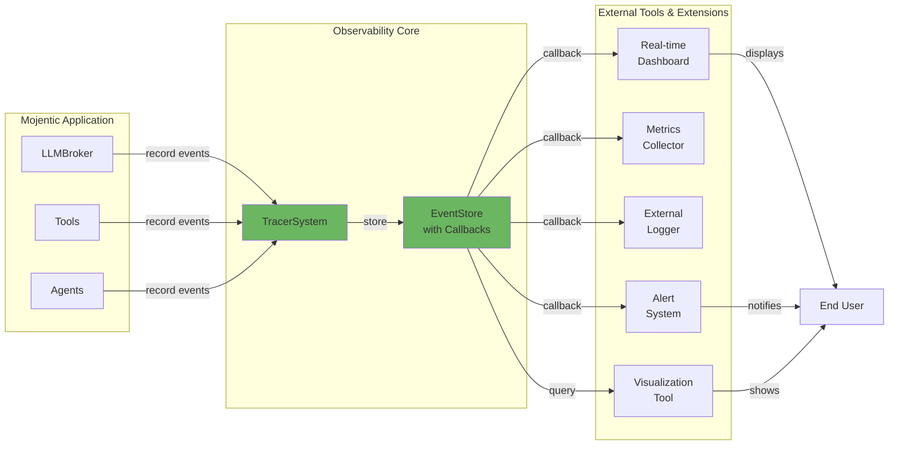
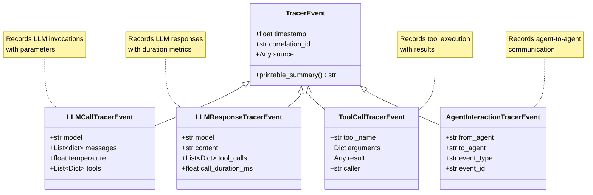
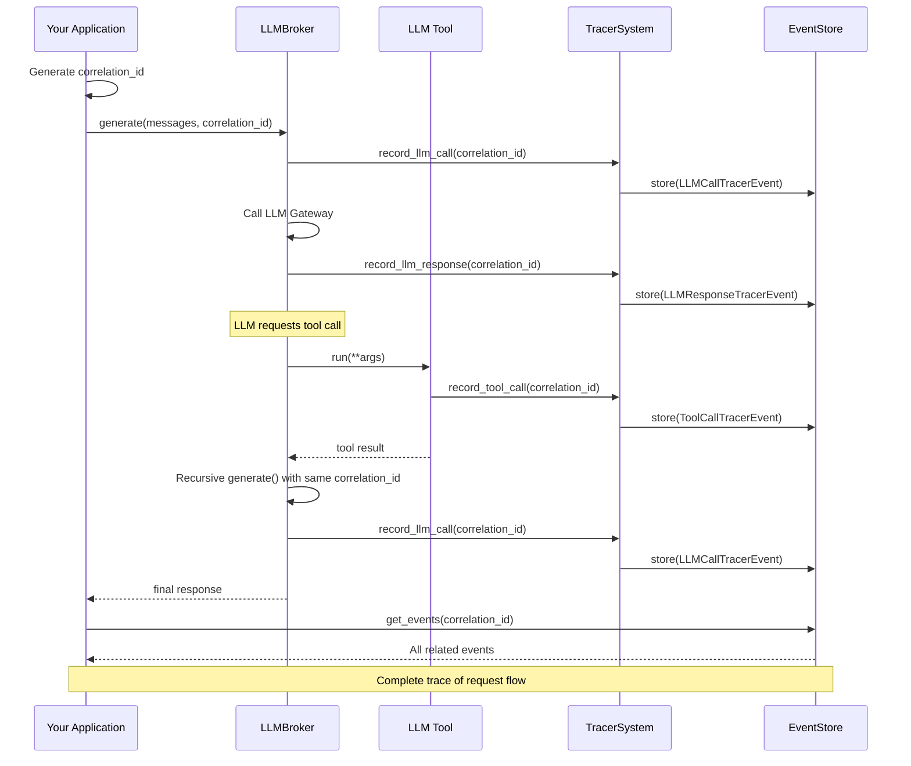
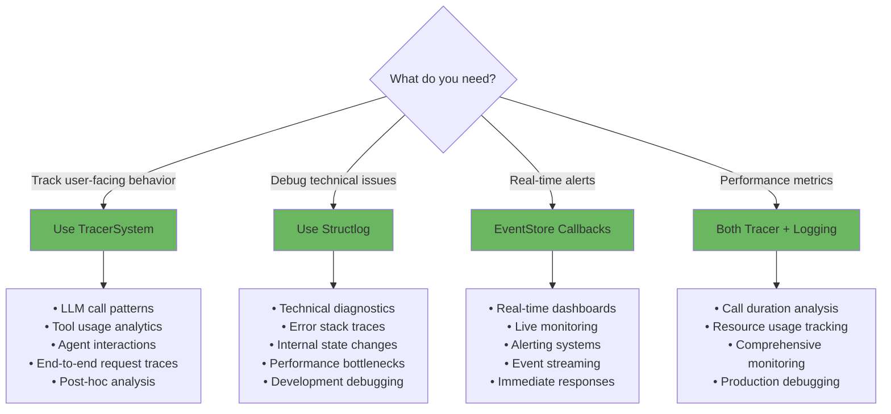

# Mojentic Observability Features

This document provides a comprehensive overview of the observability features and hooks available in Mojentic, designed to help you monitor, debug, and understand the behavior of your agentic systems.

## Table of Contents

- [Overview](#overview)
- [Core Components](#core-components)
- [Tracer System](#tracer-system)
- [Event Store](#event-store)
- [Tracer Events](#tracer-events)
- [Integration Points](#integration-points)
- [Correlation ID](#correlation-id)
- [Structured Logging](#structured-logging)
- [Query and Filtering Capabilities](#query-and-filtering-capabilities)
- [Best Practices](#best-practices)
- [Future Enhancement Opportunities](#future-enhancement-opportunities)

## Overview

Mojentic provides multiple layers of observability to help you understand what's happening in your agentic systems:

1. **Tracer System**: High-level tracking of LLM calls, tool usage, and agent interactions
2. **Structured Logging**: Low-level technical diagnostics using structlog
3. **Event Store Callbacks**: Real-time notifications when events are recorded

These features work together to provide both real-time monitoring and post-hoc analysis capabilities.



## Core Components

### TracerSystem

The `TracerSystem` is the central component for recording and querying tracer events.

**Location**: `src/mojentic/tracer/tracer_system.py`

**Key Features**:
- Records LLM calls, responses, tool usage, and agent interactions
- Supports enable/disable functionality for production/development switching
- Provides multiple query and filtering methods
- Uses Null Object Pattern for optional tracing

**Initialization**:
```python
from mojentic.tracer import TracerSystem

# Basic initialization
tracer = TracerSystem()

# With custom event store
from mojentic.tracer import EventStore
event_store = EventStore()
tracer = TracerSystem(event_store=event_store)

# Disabled by default
tracer = TracerSystem(enabled=False)
```

**Recording Methods**:
- `record_event(event: TracerEvent)` - Record a custom tracer event
- `record_llm_call(model, messages, temperature, tools, correlation_id)` - Record LLM invocation
- `record_llm_response(model, content, tool_calls, call_duration_ms, correlation_id)` - Record LLM response
- `record_tool_call(tool_name, arguments, result, caller, correlation_id)` - Record tool execution
- `record_agent_interaction(from_agent, to_agent, event_type, event_id, correlation_id)` - Record agent-to-agent communication

**Control Methods**:
- `enable()` - Enable event recording
- `disable()` - Disable event recording
- `clear()` - Clear all recorded events

### NullTracer

The `NullTracer` implements the Null Object Pattern, providing a no-op implementation of the TracerSystem interface.

**Location**: `src/mojentic/tracer/null_tracer.py`

**Purpose**:
- Eliminates conditional checks in client code
- Allows optional tracing without performance overhead
- All record methods silently discard events
- All query methods return empty results

**Usage**:
```python
from mojentic.tracer import null_tracer

# Use when tracer is not provided
llm = LLMBroker("model-name", tracer=null_tracer)
```

This pattern is used throughout Mojentic as the default when no tracer is provided:
```python
# In LLMBroker, Dispatcher, and LLMTool
from mojentic.tracer import null_tracer
self.tracer = tracer or null_tracer
```

## Event Store

The `EventStore` class manages storage and retrieval of events with an optional callback mechanism.

**Location**: `src/mojentic/tracer/event_store.py`

**Key Features**:
- Stores events in memory
- Supports callback notifications when events are stored
- Provides flexible querying and filtering
- Handles both tracer events and regular events

**Initialization with Callback**:
```python
from mojentic.tracer import EventStore, TracerSystem
from mojentic.tracer.tracer_events import LLMCallTracerEvent

# Define a callback function
def on_event_stored(event):
    if isinstance(event, LLMCallTracerEvent):
        print(f"LLM call to model {event.model} with {len(event.messages)} messages")

# Create EventStore with callback
event_store = EventStore(on_store_callback=on_event_stored)

# Create TracerSystem with the observable EventStore
tracer = TracerSystem(event_store=event_store)
```

**Methods**:
- `store(event: Event)` - Store an event (triggers callback if configured)
- `get_events(event_type, start_time, end_time, filter_func)` - Query events with filters
- `get_last_n_events(n, event_type)` - Get the most recent N events
- `clear()` - Clear all events

**Callback Use Cases**:
- Real-time monitoring dashboards
- Alerting on specific event patterns
- Streaming events to external systems
- Performance metrics collection
- Debugging and troubleshooting



**Building External Tools**:

External tools can leverage Mojentic's observability through two mechanisms:

1. **Real-time Callbacks**: React immediately to events as they occur
   ```python
   def send_to_dashboard(event):
       dashboard_client.send(event.model_dump())
   
   event_store = EventStore(on_store_callback=send_to_dashboard)
   tracer = TracerSystem(event_store=event_store)
   ```

2. **Post-hoc Queries**: Analyze events after they've been collected
   ```python
   # Query for visualization
   events = tracer.get_events(event_type=LLMCallTracerEvent)
   create_visualization(events)
   ```

## Tracer Events

All tracer events inherit from `TracerEvent`, which extends the core `Event` class.

**Location**: `src/mojentic/tracer/tracer_events.py`



### Base TracerEvent

**Common Attributes**:
- `timestamp: float` - Unix timestamp when the event occurred
- `correlation_id: str` - UUID for tracing related events
- `source: Any` - Type of the component that created the event

**Method**:
- `printable_summary() -> str` - Returns a formatted string summary

### LLMCallTracerEvent

Records when an LLM is invoked.

**Attributes**:
- `model: str` - The LLM model name
- `messages: List[dict]` - Messages sent to the LLM
- `temperature: float` - Temperature setting (default: 1.0)
- `tools: Optional[List[Dict]]` - Available tools

**Use Cases**:
- Track which models are being used
- Monitor prompt engineering patterns
- Analyze token usage (via message content)
- Debug tool availability issues

### LLMResponseTracerEvent

Records when an LLM responds.

**Attributes**:
- `model: str` - The LLM model name
- `content: str` - Response content
- `tool_calls: Optional[List[Dict]]` - Tool calls made by the LLM
- `call_duration_ms: Optional[float]` - Call duration in milliseconds

**Use Cases**:
- Performance monitoring (call duration)
- Response quality analysis
- Tool call pattern identification
- Cost estimation

### ToolCallTracerEvent

Records tool execution.

**Attributes**:
- `tool_name: str` - Name of the tool
- `arguments: Dict[str, Any]` - Tool arguments
- `result: Any` - Tool execution result
- `caller: Optional[str]` - Component that called the tool

**Use Cases**:
- Tool usage analytics
- Error tracking (via result field)
- Performance profiling
- Debugging tool behavior

### AgentInteractionTracerEvent

Records agent-to-agent communication.

**Attributes**:
- `from_agent: str` - Sending agent name
- `to_agent: str` - Receiving agent name
- `event_type: str` - Type of event being processed
- `event_id: Optional[str]` - Event identifier

**Use Cases**:
- Visualize agent communication patterns
- Debug routing issues
- Analyze workflow execution
- Identify bottlenecks

## Integration Points

The tracer system integrates with multiple Mojentic components:

### LLMBroker

**Location**: `src/mojentic/llm/llm_broker.py`

The `LLMBroker` automatically records:
- LLM calls before sending to the gateway
- LLM responses after receiving from the gateway
- Tool calls triggered by the LLM
- Call duration for performance monitoring

**Integration**:
```python
from mojentic.tracer import TracerSystem
from mojentic.llm import LLMBroker

tracer = TracerSystem()
llm = LLMBroker("llama3.3-70b-32k", tracer=tracer)

# All LLM interactions are now traced
response = llm.generate(messages, correlation_id="unique-id")
```

### Dispatcher

**Location**: `src/mojentic/dispatcher.py`

The `Dispatcher` records agent interactions when routing events.

**Integration**:
```python
from mojentic import Dispatcher, Router
from mojentic.tracer import TracerSystem

tracer = TracerSystem()
router = Router({...})
dispatcher = Dispatcher(router, tracer=tracer)

# Agent interactions are now traced
dispatcher.dispatch(event)
```

### LLMTool

**Location**: `src/mojentic/llm/tools/llm_tool.py`

The `LLMTool` base class supports tracer integration for all tools.

**Integration**:
```python
from mojentic.llm.tools.llm_tool import LLMTool
from mojentic.tracer import TracerSystem

class CustomTool(LLMTool):
    def __init__(self, tracer=None):
        super().__init__(tracer=tracer)
    
    def run(self, **kwargs):
        # Tool logic
        return result

# Usage
tracer = TracerSystem()
tool = CustomTool(tracer=tracer)
```

The `call_tool` method automatically records tool calls with the tracer.

### AsyncDispatcher

**Location**: `src/mojentic/async_dispatcher.py`

Similar to the synchronous Dispatcher, supports tracer integration for async workflows.

## Correlation ID

The `correlation_id` is a critical feature for tracing related events across the system.

**Purpose**:
- Links related events together (e.g., LLM call → LLM response → Tool call)
- Enables end-to-end request tracing
- Facilitates debugging complex workflows
- Creates audit trails



**How It Works**:
1. Generate a unique correlation_id at the start of a request
2. Pass it through all method calls
3. Query events by correlation_id to see the complete flow

**Example**:
```python
import uuid
from mojentic.tracer import TracerSystem

tracer = TracerSystem()
correlation_id = str(uuid.uuid4())

# All related operations use the same correlation_id
response = llm.generate(messages, correlation_id=correlation_id)

# Later, retrieve all related events
related_events = tracer.get_events(
    filter_func=lambda e: e.correlation_id == correlation_id
)
```

**Propagation**:
- LLMBroker propagates correlation_id through recursive calls
- Dispatcher auto-generates correlation_id if not provided
- Tools receive correlation_id from their caller

## Structured Logging

Mojentic uses **structlog** for low-level technical logging.

**Location**: `src/mojentic/__init__.py`

**Configuration**:
```python
import structlog

structlog.configure(
    logger_factory=structlog.stdlib.LoggerFactory(),
    processors=[
        structlog.stdlib.filter_by_level,
        structlog.stdlib.add_logger_name,
        structlog.stdlib.add_log_level,
        structlog.processors.TimeStamper(fmt="iso"),
        structlog.processors.JSONRenderer()
    ]
)
```

**Features**:
- JSON output for machine parsing
- ISO timestamps
- Structured key-value pairs
- Log level filtering

**Usage Throughout Codebase**:
```python
import structlog

logger = structlog.get_logger()

# Structured logging with context
logger.info("Requesting llm response", 
            approximate_tokens=approximate_tokens)
logger.debug("Processing event", event=event)
logger.warn("Function not found", function=tool_call.name)
```

**Best Practices**:
- Use DEBUG for detailed diagnostics
- Use INFO for lifecycle events
- Use WARNING for recoverable issues
- Use ERROR for user-visible problems
- Never use `print()` for diagnostics (reserved for user-facing CLI output)

## Query and Filtering Capabilities

The TracerSystem provides powerful querying capabilities:

### By Event Type

```python
# Get all LLM calls
llm_calls = tracer.get_events(event_type=LLMCallTracerEvent)

# Get all tool calls
tool_calls = tracer.get_events(event_type=ToolCallTracerEvent)
```

### By Time Range

```python
import time

# Events in the last hour
recent = tracer.get_events(
    start_time=time.time() - 3600,
    end_time=time.time()
)
```

### By Custom Filter

```python
# Failed tool calls
failed = tracer.get_events(
    filter_func=lambda e: isinstance(e, ToolCallTracerEvent) 
                         and "error" in str(e.result)
)

# Slow LLM calls (> 5 seconds)
slow = tracer.get_events(
    filter_func=lambda e: isinstance(e, LLMResponseTracerEvent) 
                         and e.call_duration_ms > 5000
)
```

### Latest N Events

```python
# Last 10 events
recent = tracer.get_last_n_tracer_events(10)

# Last 5 tool calls
recent_tools = tracer.get_last_n_tracer_events(5, event_type=ToolCallTracerEvent)
```

### Combined Filters

```python
# Recent failed tool calls
failed_recent = tracer.get_events(
    event_type=ToolCallTracerEvent,
    start_time=time.time() - 3600,
    filter_func=lambda e: "error" in str(e.result)
)
```

### By Correlation ID

```python
# All events for a specific request
request_events = tracer.get_events(
    filter_func=lambda e: e.correlation_id == "specific-uuid"
)
```

## Best Practices

### When to Use Which Feature

Understanding when to use tracer events versus structured logging is key to effective observability:



### 1. Use Tracer for High-Level Observability

The tracer system is designed for understanding **what** happened, not **how** it happened:

✅ **Good**: "The LLM called the date_resolver tool 3 times"
❌ **Avoid**: "The tokenizer encoded 142 tokens"

Use structured logging for low-level technical details.

### 2. Always Use Correlation IDs

Generate correlation IDs at the entry point of your application:

```python
import uuid

correlation_id = str(uuid.uuid4())
response = llm.generate(messages, correlation_id=correlation_id)
```

### 3. Leverage EventStore Callbacks for Real-Time Monitoring

Don't poll for events; use callbacks for immediate notification:

```python
def alert_on_errors(event):
    if isinstance(event, ToolCallTracerEvent):
        if "error" in str(event.result):
            send_alert(f"Tool {event.tool_name} failed")

event_store = EventStore(on_store_callback=alert_on_errors)
tracer = TracerSystem(event_store=event_store)
```

### 4. Use NullTracer in Production if Needed

The NullTracer allows you to disable tracing with zero overhead:

```python
from mojentic.tracer import null_tracer

# Production mode - no tracing overhead
llm = LLMBroker("model", tracer=null_tracer)
```

### 5. Query Events Post-Hoc for Analysis

After an interaction, analyze the events:

```python
# Analyze tool usage
tool_calls = tracer.get_events(event_type=ToolCallTracerEvent)
tool_usage = {}
for event in tool_calls:
    tool_usage[event.tool_name] = tool_usage.get(event.tool_name, 0) + 1

print("Tool usage frequency:")
for tool, count in tool_usage.items():
    print(f"  {tool}: {count} calls")
```

### 6. Use Printable Summaries for Human-Readable Output

All tracer events have a `printable_summary()` method:

```python
events = tracer.get_events()
for event in events:
    print(event.printable_summary())
```

### 7. Clear Events Between Test Runs

In testing scenarios, clear events to avoid pollution:

```python
def setup_function():
    tracer.clear()
```

### 8. Enable/Disable Dynamically

Control tracing at runtime:

```python
tracer.disable()  # During intensive processing
tracer.enable()   # When debugging
```

## Future Enhancement Opportunities

Based on the current observability infrastructure, here are potential areas for enhancement:

### 1. Tracing for Async Operations

**Current State**: AsyncDispatcher exists but tracer integration could be enhanced

**Enhancement**:
- Add async-specific tracer events (e.g., `AsyncTaskStartedEvent`, `AsyncTaskCompletedEvent`)
- Track concurrent operation patterns
- Measure async performance characteristics

### 2. Metrics and Aggregation

**Current State**: Raw events are stored, aggregation done manually

**Enhancement**: Add built-in aggregation capabilities:
- Average LLM call duration by model
- Tool usage frequency statistics
- Agent interaction graph visualization data
- Cost estimation based on token counts

### 3. Event Export and Integration

**Current State**: Events are stored in-memory only

**Enhancement**: Add export capabilities:
- Export to file (JSON, CSV)
- Stream to external systems (OpenTelemetry, Prometheus)
- Database persistence options
- Integration with APM tools

### 4. Visual Tracing Tools

**Current State**: Text-based event inspection via `printable_summary()`

**Enhancement**: Create visualization tools:
- Timeline view of events
- Correlation ID trace viewer (like distributed tracing)
- Agent interaction graph
- Performance flamegraphs

### 5. Query DSL

**Current State**: Python lambda functions for filtering

**Enhancement**: Add a query DSL for more expressive filtering:
```python
tracer.query("event_type=ToolCall AND tool_name='date_resolver' AND duration>1000")
```

### 6. Event Versioning and Schema Evolution

**Current State**: Tracer events are Pydantic models

**Enhancement**:
- Add version field to events
- Support schema migration
- Backward compatibility guarantees

### 7. Performance Profiling Integration

**Current State**: Call duration is recorded for LLM responses

**Enhancement**: Add comprehensive profiling:
- Memory usage tracking
- CPU profiling hooks
- Automatic performance regression detection

### 8. Audit Trail and Compliance

**Current State**: Basic event recording

**Enhancement**: Add compliance features:
- Event signing and verification
- Immutable audit logs
- Compliance report generation
- Data retention policies

### 9. Context Managers for Tracing Scopes

**Current State**: Manual correlation_id management

**Enhancement**: Add context managers:
```python
with tracer.trace_scope() as scope:
    # All operations automatically use scope.correlation_id
    response = llm.generate(messages)
```

### 10. Sampling and Rate Limiting

**Current State**: All events are recorded when enabled

**Enhancement**: Add sampling capabilities:
- Record every Nth event
- Sample based on percentage
- Rate limit high-frequency events
- Adaptive sampling based on system load

### 11. Event Retention Policies

**Current State**: Events accumulate indefinitely until cleared

**Enhancement**: Add automatic retention policies:
- Time-based expiration
- Size-based limits (keep last N events)
- Importance-based retention (keep errors longer)

## Summary

Mojentic provides a comprehensive observability stack:

- **TracerSystem**: High-level event tracking for agentic interactions
- **EventStore**: Flexible storage with callback hooks
- **Structured Logging**: Low-level technical diagnostics
- **Correlation IDs**: End-to-end request tracing
- **Query Capabilities**: Powerful filtering and analysis

These features work together to provide visibility into your agentic systems, enabling debugging, monitoring, and optimization. The architecture is designed to be non-intrusive, configurable, and extensible, supporting both development and production use cases.

## Resources

- **Tracer Documentation**: `docs/tracer.md`
- **Example Script**: `src/_examples/tracer_demo.py`
- **API Documentation**: See mkdocs site under "Observability"
- **Source Code**: 
  - `src/mojentic/tracer/` - Tracer system implementation
  - `src/mojentic/__init__.py` - Structured logging configuration
  - `src/mojentic/llm/llm_broker.py` - LLM tracing integration
  - `src/mojentic/dispatcher.py` - Agent interaction tracing
