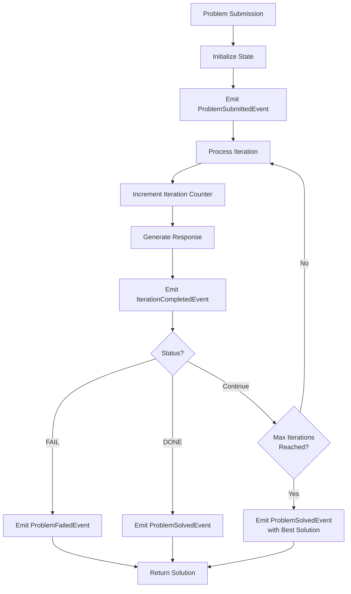

# Simple Recursive Agent

The `SimpleRecursiveAgent` is an asynchronous, event-driven agent that recursively attempts to solve a problem using available tools until it either succeeds, fails, or reaches a maximum number of iterations.

## How It Works



The `SimpleRecursiveAgent` uses an event-driven approach to solve problems. At each step, the agent:

1. Processes an iteration of the problem-solving process
2. Generates a response using the LLM
3. Emits an event with the response
4. Checks if the problem is solved, failed, or needs another iteration

The agent continues until one of three conditions is met:
1. It successfully completes the task (responds with "DONE")
2. It fails to complete the task (responds with "FAIL")
3. It reaches the maximum number of allowed iterations

## Event-Driven Architecture

The `SimpleRecursiveAgent` uses an event emitter pattern to handle different stages of the problem-solving process. This allows for a more declarative approach to problem-solving and enables monitoring and reacting to the agent's progress.

Key events include:
- `ProblemSubmittedEvent`: Triggered when a problem is submitted for solving
- `IterationCompletedEvent`: Triggered when an iteration is completed
- `ProblemSolvedEvent`: Triggered when a problem is solved
- `ProblemFailedEvent`: Triggered when a problem cannot be solved
- `TimeoutEvent`: Triggered when the problem-solving process times out

## Basic Usage

```python
import asyncio
from mojentic.agents import SimpleRecursiveAgent
from mojentic.llm import LLMBroker

async def solve_problem():
    # Initialize an LLM broker
    llm = LLMBroker(model="your-preferred-model")
    
    # Create the agent with necessary tools
    agent = SimpleRecursiveAgent(
        llm=llm,
        max_iterations=5  # Maximum number of iterations
    )
    
    # Define a problem to solve
    problem = "What is the capital of France?"
    
    # Solve the problem asynchronously
    solution = await agent.solve(problem)
    print(solution)

# Run the async function
asyncio.run(solve_problem())
```

## Advanced Usage with Event Handling

```python
import asyncio
from mojentic.agents import SimpleRecursiveAgent
from mojentic.llm import LLMBroker
from mojentic.agents.simple_recursive_agent import ProblemSolvedEvent, IterationCompletedEvent

async def solve_with_events():
    # Initialize an LLM broker
    llm = LLMBroker(model="your-preferred-model")
    
    # Create the agent
    agent = SimpleRecursiveAgent(llm=llm, max_iterations=5)
    
    # Define event handlers
    def on_iteration_completed(event):
        print(f"Iteration {event.state.iteration} completed")
    
    def on_problem_solved(event):
        print(f"Problem solved after {event.state.iteration} iterations")
    
    # Subscribe to events
    unsubscribe_iteration = agent.emitter.subscribe(IterationCompletedEvent, on_iteration_completed)
    unsubscribe_solved = agent.emitter.subscribe(ProblemSolvedEvent, on_problem_solved)
    
    # Solve the problem
    problem = "What are the three primary colors?"
    solution = await agent.solve(problem)
    print(f"Solution: {solution}")
    
    # Unsubscribe from events
    unsubscribe_iteration()
    unsubscribe_solved()

# Run the async function
asyncio.run(solve_with_events())
```

## Concurrent Problem Solving

The asynchronous nature of the `SimpleRecursiveAgent` allows for solving multiple problems concurrently:

```python
import asyncio
from mojentic.agents import SimpleRecursiveAgent
from mojentic.llm import LLMBroker

async def solve_multiple_problems():
    # Initialize an LLM broker
    llm = LLMBroker(model="your-preferred-model")
    
    # Create the agent
    agent = SimpleRecursiveAgent(llm=llm, max_iterations=5)
    
    # Define multiple problems
    problems = [
        "What is the Pythagorean theorem?",
        "Explain the concept of recursion in programming."
    ]
    
    # Create tasks for all problems and run them concurrently
    tasks = [agent.solve(problem) for problem in problems]
    solutions = await asyncio.gather(*tasks)
    
    # Print solutions
    for problem, solution in zip(problems, solutions):
        print(f"Problem: {problem}")
        print(f"Solution: {solution}\n")

# Run the async function
asyncio.run(solve_multiple_problems())
```