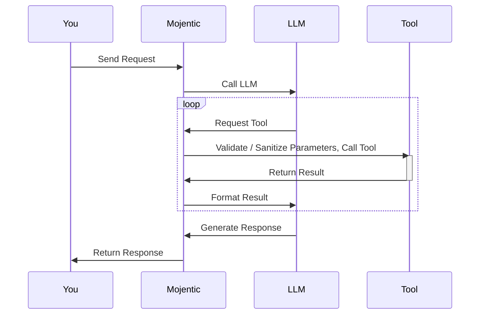

# Using Tools with LLMs in Mojentic

## Why Use Tools with LLMs?

Large Language Models (LLMs) are powerful for generating text, but they have limitations. They may not have access to real-time information, specialized knowledge, or the ability to perform specific calculations. This is where tools come in. By integrating tools with LLMs, you can:

- Extend the LLM's capabilities beyond its training data
- Enable the LLM to perform specific actions or calculations
- Provide the LLM with access to external data sources
- Improve the accuracy and reliability of LLM responses
- Create more powerful and versatile AI applications

Tools essentially allow LLMs to request specialized capabilities. When an LLM identifies the need for a tool, it makes a request that the Mojentic LLMBroker detects. The broker then calls the appropriate tool and passes the results back to the LLM, making the system much more powerful and practical for real-world applications.



All you have to do as a developer is supply the available tools to the LLMBroker, and it will handle the rest. The LLM will automatically request the tools it needs, and the broker will manage the execution and response formatting.

> Not all LLMs support tool usage, and not all those that do will issue multiple tool calls per request.

## When to Apply This Approach

Use tools with LLMs when:
- You need the LLM to access information beyond its training data
- Your application requires precise calculations or specialized operations
- You want to integrate the LLM with external systems or APIs
- You need to ensure accurate and up-to-date responses
- The LLM needs to perform actions that it cannot do through text generation alone

Common examples include date/time calculations, web searches, database queries, API calls, and specialized domain-specific operations.

## Getting Started

Let's walk through an example of using tools with Mojentic. We'll use the built-in `ResolveDateTool` to help the LLM understand and resolve date-related queries.

### Basic Implementation

Here's a simple example of using a tool with an LLM:

```python
from mojentic.llm.gateways.models import LLMMessage
from mojentic.llm.llm_broker import LLMBroker
from mojentic.llm.tools.date_resolver import ResolveDateTool

# Create an LLM broker with a specified model
llm = LLMBroker(model="qwen3")

# Generate a response with tool assistance
result = llm.generate(
    messages=[LLMMessage(content='What is the date on Friday?')],
    tools=[ResolveDateTool()]
)

print(result)
```

This code will generate a response that uses the date resolver tool to accurately determine the date of the upcoming Friday.

## Step-by-Step Explanation

Let's break down how this example works:

### 1. Import the necessary components

```python
from mojentic.llm.gateways.models import LLMMessage
from mojentic.llm.llm_broker import LLMBroker
from mojentic.llm.tools.date_resolver import ResolveDateTool
```

These imports provide:
- `LLMMessage`: A class for creating messages to send to the LLM
- `LLMBroker`: The main interface for interacting with LLMs
- `ResolveDateTool`: A built-in tool for resolving date-related queries

### 2. Create an LLM broker

```python
llm = LLMBroker(model="qwen3")
```

Just like in previous examples, we create an LLM broker with a required model parameter that specifies which LLM to use.

### 3. Generate text with tool assistance

```python
result = llm.generate(
    messages=[LLMMessage(content='What is the date on Friday?')],
    tools=[ResolveDateTool()]
)
```

The key difference from simple text generation:
- We provide the `tools` parameter with a list of tools that can be used during the generation process
- In this case, we're providing the `ResolveDateTool`
- When the LLM determines it needs date-related information, it will request the tool, which the LLMBroker will detect, execute, and pass the results back to the LLM

### 4. Behind the scenes

When the LLM receives the query "What is the date on Friday?", it recognizes that it needs to determine a specific date. Here's what happens:

1. The LLM recognizes that it needs to resolve a date
2. It requests that the `ResolveDateTool` be called
3. The LLMBroker detects this request and calls the tool
4. The tool calculates the date of the upcoming Friday
5. The LLMBroker passes the tool's result back to the LLM
6. The LLM incorporates this information into its response

This process is handled automatically by Mojentic's LLMBroker and tool integration system.

## Creating Custom Tools

While Mojentic provides several built-in tools, you can also create your own custom tools. Here's a simple example of creating a custom calculator tool - but see if you can spot the potential security issues with this approach:

```python
from pydantic import BaseModel, Field
from mojentic.llm.tools.base import LLMTool

class CalculatorInput(BaseModel):
    expression: str = Field(..., description="The mathematical expression to evaluate")

class CalculatorTool(LLMTool):
    name = "calculator"
    description = "Evaluates mathematical expressions"
    input_model = CalculatorInput

    def execute(self, input_data: CalculatorInput) -> str:
        try:
            result = eval(input_data.expression)
            return f"The result of {input_data.expression} is {result}"
        except Exception as e:
            return f"Error evaluating expression: {str(e)}"

# Use the custom tool
llm = LLMBroker(model="qwen3")
result = llm.generate(
    messages=[LLMMessage(content='What is 123 * 456?')],
    tools=[CalculatorTool()]
)
print(result)
```

Right, the use of `eval()` is a potential security risk, as it can execute arbitrary code. You should implement proper validation and sanitization of the input to avoid possible security vulnerabilities to maliciously trained models.

## Using Multiple Tools

You can provide multiple tools to the LLM, and it will choose the appropriate one based on the query:

```python
from mojentic.llm.tools.organic_web_search import WebSearchTool

# Create an LLM broker with a specified model
llm = LLMBroker(model="qwen3")

# Generate a response with multiple tools
result = llm.generate(
    messages=[LLMMessage(content='What is the weather in New York today and what day of the week is it?')],
    tools=[ResolveDateTool(), WebSearchTool()]
)

print(result)
```

## Using Different LLM Providers

Just like with previous examples, you can use different LLM providers:

```python
import os
from mojentic.llm.gateways.openai import OpenAIGateway

# Set up OpenAI
api_key = os.getenv("OPENAI_API_KEY")
gateway = OpenAIGateway(api_key)
llm = LLMBroker(model="gpt-4o", gateway=gateway)

# Generate a response with tool assistance
result = llm.generate(
    messages=[LLMMessage(content='What is the date on Friday?')],
    tools=[ResolveDateTool()]
)
```

## Summary

Using tools with LLMs in Mojentic allows you to extend the capabilities of language models beyond simple text generation. In this example, we've learned:

1. How to provide tools to an LLM using the `tools` parameter
2. How the LLM requests tools and the LLMBroker handles these requests
3. How to create custom tools for specialized tasks
4. How to use multiple tools together

This approach enables more powerful and accurate AI applications by combining the natural language understanding of LLMs with the precision and specialized capabilities of tools. By integrating tools with LLMs, you can build applications that not only understand user queries but can also take action to provide more accurate, up-to-date, and useful responses.
